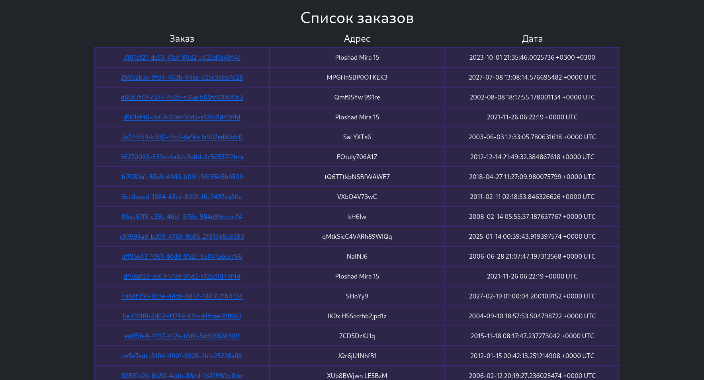
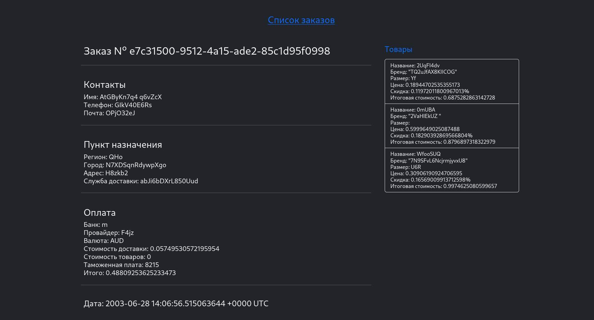

# TASK L0

## Как пользоваться
Запуск
```shell
make
```

Для запуска скрипта, публикующего данные в канал,
в отдельном окне нужно ввести
```shell
make send
```

Для запуска скрипта из контейнера
```shell
make send_docker
```

Запуск приложения в фоновом режиме сразу вместе со скриптом
```shell
make silent_start_with_send
```

Остановить контейнеры
```shell
make stop
```

Удалить логи, данные, контейнеры
```shell
make clean
```

## Используемые порты
- 5101, 4222, 8082
- Для очистки портов можно использовать
```shell
make clean_ports
```
- По умолчанию, взаимодействие с сервером происходит по адресу http://localhost:8082

## Интерфейс



## Задание
- Развернуть локально PostgreSQL
- Создать свою БД
- Настроить своего пользователя
- Создать таблицы для хранения полученных данных
- Разработать сервис
- Реализовать подключение и подписку на канал в nats-streaming
- Полученные данные записывать в БД
- Реализовать кэширование полученных данных в сервисе (сохранять in memory)
- В случае падения сервиса необходимо восстанавливать кэш из БД
- Запустить http-сервер и выдавать данные по id из кэша
- Разработать простейший интерфейс отображения полученных данных по id заказа
